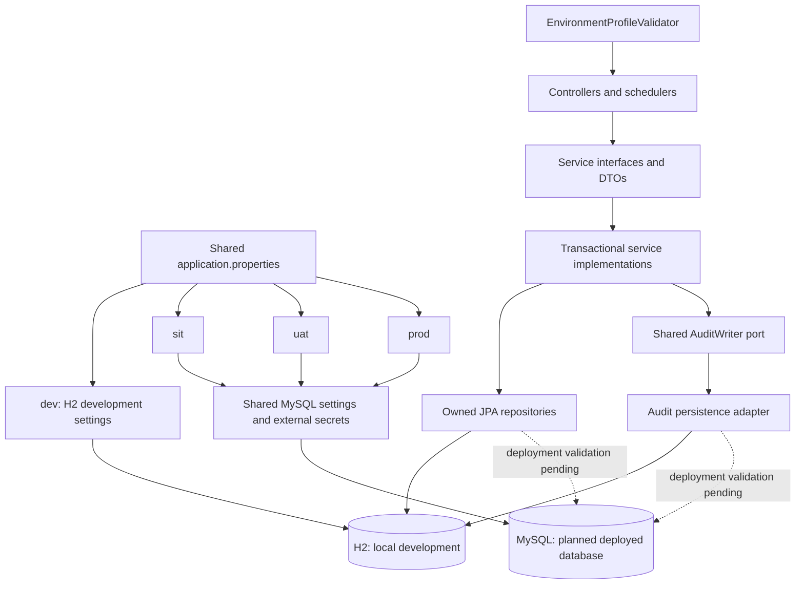

# Architecture and extension guide

## Transaction boundaries

Submission stores a pending proposal and its evidence in one transaction. Approval validates distinct maker/checker identities, current permissions and the baseline version, then applies the approved record, completes the request and appends evidence atomically. Unique business/pending keys and optimistic versions protect concurrent decisions. Rejection changes only the proposal and appends decision evidence.

AuditWriter requires an existing transaction. Unexpected audit persistence failure is propagated; it is never replaced by a best-effort log. The database application principal has no UPDATE/DELETE authority on the evidence table.

Security administration uses its own service/contracts and the same audit writer. Access checks resolve current active memberships and action/scope grants. Action from one grant is never paired with another grant's unrelated scope. Group names are not hard-coded permission checks.

## Reports

Both manual requests and scheduled occurrences persist report jobs. A worker processes bounded snapshots with repeatable-read isolation and a row lock, renders through a format strategy and stores the complete artifact separately from job metadata. Only successful complete artifacts become Ready. The chosen initial implementation uses a bounded transaction during generation; large/distributed reporting should replace that with a durable materialised snapshot before moving rendering outside the transaction.

Artifacts have an audience and a feature/scope/field footprint. Every download rechecks current permissions over that footprint. Revoked field access prevents downloading an older broader artifact. Snapshot fields are allowlisted in feature definitions; optional grant `hiddenFields` restrictions remove fields from evidence responses and exports. Generated-file expiry is separate from evidence expiry.

Schedules are owned by a user and can target one of that user's groups. Eligibility is rechecked on each occurrence and for each download. Group schedules are currently **user-owned with a group audience**, not independent service-account-owned schedules. Removing the owner's schedule/generation authority suspends the schedule.

## Adding a feature

1. Register a `FeatureDefinition` bean with a stable key, label and allowlisted fields. The current six definitions demonstrate dates, decimals and text.
2. Add richer domain validation/application behaviour when the new entity has relationships or invariants beyond this generic setup model. Do not invent those rules from a feature label.
3. Grant explicit feature/action/scope permissions through approved administration. Registration alone grants no access (existing wildcard grants are explicitly broad).
4. The registry-driven UI, proposal lifecycle and generic static-data audit report work without copying their implementation.
5. Add feature-specific positive/negative rules and rerun the shared integration/architecture suite.

For a new format, implement ReportRenderer and register one bean per ReportFormat. For a new business module such as accounting, call AuditWriter from the business transaction with its own verified before/after snapshot and references. Never expose an unauthorised public endpoint that lets clients manufacture audit history.

## Boundaries and naming

Tables use `cc_`; Java types use PascalCase. Request/response DTOs are explicit records. Stable enums represent fixed states; groups, grants and feature keys remain data-driven. `ApiRoutes` centralises backend paths; `app.js` has one client route catalogue. Generated OpenAPI verifies actual mappings. Feature-owned `ErrorDefinition` catalogues and `messages.properties` separate machine codes, transport policy and safe user messages.

Shared logging configuration and CorrelationFilter own trace creation/cleanup. Components log meaningful events using SLF4J. GlobalExceptionHandler and security handlers translate boundary failures, with diagnostic causes restricted to logs.

## Deployment decisions

H2 file mode is a single local process deployment. It is not a demonstrated distributed production topology. Before deploying at seven-year scale, validate volume, query latency, report sizes, cleanup throughput, backup/restore, credential provisioning, TLS, monitoring and organisational retention rules. A new database needs migrations and integration tests against that database; a datasource URL change alone is insufficient.

## Package and service boundaries (PRD v1.8)

See [the package inventory](package-structure.md) for the actual source locations. The original flat packages have been replaced with responsibility packages. Controllers inject service interfaces; transactional classes live in `service.impl`. Entities have private state and remain in their owning module's `model` package. DTOs are individual request/response records, and mapping is separated where it is shared.

ReportService is the user-facing contract. ReportScheduleService and ReportWorkerService separate schedule management and background execution from report access. GlobalExceptionHandler and ErrorResponseFactory live in the application's `exception.handler` package; ApiRoutes is in `constants`. No SQL migration is needed for package relocation.

## Reusing audit capture (PRD v1.10)

The common entry point is `AuditWriter.append(AuditDraft)`. Inject this core interface into a transactional business service. Build the draft with `AuditDraft.builder(AuditCategory.STATIC)` and its descriptive methods: feature, scope, recordId, reference, action, status, actor, maker, checker, reason, source, before and after. Both snapshots must be explicit; use an empty map for an activity without changed values. The checker defaults to empty for events without a checker. Supply authenticated actors and validated server-side snapshots, never an arbitrary browser-provided audit payload.

`AuditDraftBuilder` provides readable construction, and the immutable `AuditDraft` enforces required evidence and copies the snapshots. `AuditWriterImpl` supplies the server time, secure event ID and trace ID and flushes evidence within the caller's transaction. It propagates failure, so a business change cannot commit without its evidence. `AuditServiceImpl` now handles reads only. Reporting injects both interfaces because it searches evidence and records report activities.

For a concrete integration, see `WorkflowServiceImpl.propose` and `decide`; administration, import and report services use the same contract. A seventh feature using the existing setup workflow automatically receives the existing proposal/decision events. Add explicit capture calls only for additional domain activities, and add regression tests proving those transition paths call the writer. This is explicit capture, not automatic detection of every arbitrary repository write.

The HTTP `CorrelationFilter` supplies request context and diagnostics; it does not infer business changes. Generic AOP and JPA listeners are not installed. Outbox delivery is a future option when evidence needs a separate distributed destination; this implementation writes evidence synchronously to the same database transaction. See PRD section 30 for the alternatives and acceptance criteria.

## Naming and readability (PRD v1.11)

Java variables and parameters, including lambda and exception parameters, name their actual roles. Audit search uses `auditEvent`, `auditSearchRequest`, `auditEventRoot`, `criteriaQuery`, `criteriaBuilder` and `predicates`. Mappers, security callbacks, workflows, reports and test fixtures follow the same convention.

`buildAuthorisedSearchSpecification` pairs feature/scope permissions before pagination. `toAuthorisedAuditResponse` removes fields hidden by current permissions. `addExactMatchPredicate`, `addContainsPredicate` and `escapedContainsPattern` describe search construction. Reporting uses `canDownloadReport` and `recordReportActivity`; exception handlers have explicit `handle...` names.

`NamingConventionTest` parses production and test Java declarations using the JDK compiler API. It rejects lowercase one/two-letter names and `req`, `res`, `obj`, `tmp`, while retaining the existing `id` and `to` contracts. It does not inspect comments, SQL aliases or generic type parameters. Semantic review remains necessary: increasing a name's length alone does not make it meaningful.

## Environment and database architecture (PRD v1.12)

Configuration changes database wiring, not controller or domain dependencies. An environment post-processor runs after configuration loading and rejects mixed environments, deployed demo profiles and wrong database vendors before connecting. JPA schema validation remains enabled in all environments. Development Flyway uses unchanged H2 scripts in a vendor-specific folder; previously applied checksums are preserved.

MySQL preparation includes connection profiles and a JDBC driver. Its schema and database account/grant provisioning remain a separate prerequisite, and application Flyway is disabled in deployed profiles until vendor migrations are delivered. Separate app/migration/retention principals are required; normal application credentials must never have audit UPDATE/DELETE authority. Retention now selects a bounded ordered batch using LIMIT and deletes by ID with a cutoff recheck, removing the H2-specific self-select DELETE/FETCH FIRST expression.

Before enabling these profiles in SIT, test against the selected MySQL version: index length/collation, foreign keys, evidence text/blob sizes, UTC Instant mappings, concurrent approvals, permission revocation, audit rollback, retention and restore. H2 tests demonstrate current development behaviour only. Profile groups follow [Spring Boot's profile configuration rules](https://docs.spring.io/spring-boot/reference/features/profiles.html).

## Typed audit adapter extension (PRD v1.13)

`AuditCapture` is the new business-event port. `AuditCaptureImpl` discovers feature-owned `AuditEventAdapter<T>` beans into an immutable exact-class registry and delegates mapped evidence to AuditWriter inside the caller's transaction. It has no workflow dependency. The existing setup workflow uses `SetupAuditEvent` and `SetupAuditEventAdapter`, shared by all registered setup features. Duplicate adapter registrations fail startup; missing adapters fail capture. Existing direct AuditWriter integrations remain supported without duplicate capture.

See [the audit integration guide](audit-integration.md) for directory ownership, patterns, a runtime diagram and the actual extension example. Generic AOP, asynchronous event delivery, hot-loaded plugins and a standalone Boot starter are not implemented.

## Maker/checker evidence semantics (PRD v1.14)

The audit contract separates `before`, `proposed` and `after`. The workflow adapter owns the translation from business transition to those generic evidence fields: submission and rejection leave `after` equal to `before`, while approval uses the server-side persisted result. This keeps workflow semantics out of the audit writer and follows dependency inversion: feature modules describe facts; the audit module only validates, stores and projects them.

Each change request creates exactly two normal events: submission and decision. Both use the immutable change-request ID as `reference`; all cycles for a record share feature, scope and business key as the audit `recordId`. The database permits only one non-null `pendingKey` for a record, while completed requests clear that key and remain stored. Optimistic versions prevent a stale or concurrent approval from applying twice.

Adding another maker/checker feature requires a stable feature definition and allowlisted snapshot mapping. Reuse `SetupAuditEventAdapter` when the common setup lifecycle fits. For a richer lifecycle, publish a feature-owned typed event and adapter and populate all three snapshots explicitly. Do not add feature switches to `AuditCaptureImpl`, accept audit values from a browser, or overwrite an earlier event to show the latest state.

## HTTP and security evidence (PRD v1.15)

`ApiAuditInterceptor` records completed MVC API requests after controller processing, when authenticated identity and the normalised Spring route template are available. Spring Security consumes login, logout and some rejected requests before MVC; its success/failure/entry-point/access-denied handlers therefore call the same `ApiAuditPublisher` explicitly. These paths are mutually exclusive and avoid duplicate endpoint events.

`AuditActivityRecorder` is a core port implemented in `cc-audit` with `REQUIRES_NEW`. It is deliberately separate from transactional `AuditWriter`: failed requests need durable evidence after their business transaction rolls back, whereas a successful business mutation must still fail closed if its mandatory business evidence cannot commit. Boundary capture failure cannot safely rewrite an already committed HTTP response, so it is logged as `audit_activity_capture_failure` for operational alerting.

The publisher sanitises and bounds untrusted strings, records only the direct peer address, and never reads bodies, passwords, cookies, tokens or authorisation headers. `ErrorResponseFactory` marks the request with the safe machine error code; stack traces remain only in protected operational logs. `SuspiciousActivityDetector` is a bounded in-memory strategy for repeated failed logins. Replace or supplement it with a shared store/SIEM adapter for clustered production detection.

All controller mappings use the `ApiRoutes` catalogue, including parameterised paths. Runtime deployment relocation uses `CC_CONTEXT_PATH`; Java annotation mappings remain compile-time constants because that is required by the language and Spring annotation contract.

## Typed exception boundary (PRD v1.16)

The exception design has three deliberately separate responsibilities: a bounded sealed `AppException` hierarchy communicates handling category, module-owned `ErrorDefinition` values carry the custom API/audit code and HTTP/retry policy, and `messages.properties` is the safe presentation catalogue. `AppException.of` maps any feature definition by category, so ordinary new codes require no central factory edit or new empty exception class.

`ErrorCatalogRegistry` discovers feature catalogue beans and fails startup for duplicate public codes or missing safe messages. `GlobalExceptionHandler` is the single MVC translation boundary. It handles the base application type once and adapts validation, binding, missing route, unsupported method/media, security, optimistic locking and persistence failures. `ErrorResponseFactory` attaches the same custom code used by HTTP audit capture. Security-filter boundaries call the factory directly because controller advice cannot see failures rejected before MVC. Background workers retain explicit job failure handling because controller advice cannot govern asynchronous execution.

See [the exception architecture](exception-architecture.md) for the dependency/flow diagram, full mapping table, safe response contract, trace lifecycle and extension rules.
