# Plugging a feature into audit capture

Use this integration when a feature has a distinct business event to map into evidence. Features using the existing setup workflow already receive submission and decision auditing through one shared adapter; do not add another capture call in their controllers.

## Directory ownership

```text
cc-core/src/main/java/com/custody/core/
  service/AuditCapture.java                  # Business-facing capture port
  service/AuditWriter.java                   # Transactional persistence port
  audit/spi/AuditEventAdapter.java           # Feature extension contract
  dto/AuditDraft.java                        # Validated immutable evidence
  builder/AuditDraftBuilder.java             # Named draft construction
cc-audit/src/main/java/com/custody/audit/
  service/impl/AuditCaptureImpl.java         # Immutable adapter registry and dispatch
  service/impl/AuditWriterImpl.java          # Event ID, UTC time, trace and persistence
cc-workflow/src/main/java/com/custody/workflow/
  audit/event/SetupAuditEvent.java           # Immutable workflow facts
  audit/adapter/SetupAuditEventAdapter.java  # Mapping shared by all setup features
  service/impl/WorkflowServiceImpl.java      # Calls capture within its transaction
cc-application/src/main/resources/
  banner.txt                                # Startup identity; no secrets
```

## Runtime flow

```mermaid
flowchart LR
  Entry[Authenticated controller or worker] --> Service[Transactional business service]
  Service --> Checks[Permissions, validation, persisted before-values]
  Checks --> Changes[Apply proposal or decision]
  Changes --> Event[Typed event with immutable snapshots]
  Event --> Capture[AuditCapture.record]
  Capture --> Adapter[Registered feature adapter]
  Adapter --> Draft[Validated AuditDraft]
  Draft --> Writer[AuditWriter]
  Writer --> Store[(Audit evidence)]
```



Business changes and evidence use the same transaction. A mapping or write failure propagates to the business service and rolls back the operation. Capture uses MANDATORY transaction propagation, so callers must enter through a transactional Spring service proxy. This is synchronous dispatch, not an asynchronous event bus.

## Existing integration example

The production `WorkflowServiceImpl` injects `AuditCapture`. After saving a proposal or decision, it creates a response snapshot and records it:

```java
ChangeRequestResponse changeResponse = responseMapper.toChangeResponse(changeRequest);
auditCapture.record(new SetupAuditEvent(changeResponse, actor, source, values));
```

`SetupAuditEventAdapter` maps the reference, feature/scope, actor, maker/checker, status, source, reason and snapshots. Submission uses the maker's reason; decisions use the checker's reason. The three maps are intentionally different: `before` is the baseline, `proposed` is the maker's validated request, and `after` is the effective result. Pending and rejected events keep `after` equal to `before`; only an approved event uses the server-persisted result. Snapshot maps are defensively copied.

## Add a new business capability

1. Create a descriptive immutable event record in that feature's `audit.event` package. Supply trusted actor, reference, reason, scope and allowlisted snapshots from the service; never accept an arbitrary audit DTO directly from the browser.
2. Implement `AuditEventAdapter<YourEvent>` in the feature's `audit.adapter` package. Return `YourEvent.class` from `eventType()` and build a validated `AuditDraft` in `toAuditDraft`. Set `.before(...)`, `.proposed(...)` and `.after(...)` explicitly for maker/checker operations; activity-only evidence may omit `proposed`, which defaults to an empty immutable map. Register the adapter using `@Component` under the existing `com.custody` scan, or an explicit bean if outside it.
3. Inject `AuditCapture` into the transactional service and call `record(event)` once at the business transition. The service owns permission checks and persisted before-values. The adapter owns only evidence mapping.
4. Add tests for the capability's snapshots, missing/invalid evidence, permission denial and rollback. Run the reactor verification suite. No central switch, registry entry or audit database migration is required merely to register an adapter.

The registry dispatches by exact event class, not class names, feature strings or inheritance guessing. Duplicate event classes fail startup. Unknown/null events and adapters returning no draft raise custom audit error `AUD-500-001`; they are never silently skipped. Bean discovery occurs at startup, so adding a plugin requires rebuilding/restarting; runtime hot loading is not provided.

## Patterns and boundaries

- **Adapter / Strategy:** each feature maps its own event through one small contract.
- **Registry:** startup bean discovery replaces hard-coded dispatch branches.
- **Dependency inversion:** features depend on core contracts; the audit implementation does not import workflow entities or adapters.
- **Builder:** named fields prevent positional evidence mistakes.
- **Single responsibility:** services own business rules, adapters own mapping, the writer owns persistence and metadata.

Direct `AuditWriter` integration remains valid for existing administration, import, report and schedule activities. Do not call both mechanisms for the same fact. Those integrations can adopt typed adapters independently without changing the central implementation.

HTTP failures are the exception to the caller-transaction rule. Application boundaries build an `AuditActivityDraft` and call `AuditActivityRecorder`, whose implementation starts `REQUIRES_NEW`; otherwise rollback would erase the attempted-operation evidence. This contract includes endpoint, method, status, outcome, safe error code, source IP, user agent, risk, duration and allowlisted metadata. Feature code should continue to use `AuditCapture`/`AuditWriter` for committed business facts.

The HTTP correlation filter remains responsible for request traces. MVC interception records request outcomes but does not infer business snapshots or approval semantics; explicit domain capture remains required. Generic AOP interception is not installed. An existing application plugging in this capability must provide an AuditWriter implementation (or the audited persistence module and its security dependencies), Clock, JSON configuration and transaction management. This repository is a modular application, not a standalone auto-configuring Spring Boot starter.
