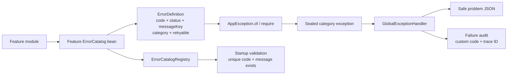

# Scalable exception and error-code architecture

## Design decision

Errors are separated into two axes:

- A small sealed exception hierarchy describes technical handling: validation, authentication, authorisation, not found, conflict, business rule, infrastructure or internal.
- A feature-owned `ErrorDefinition` describes the exact business failure: public code, HTTP status, safe message key, category and retry policy.

This avoids both unsafe generic exceptions and one empty Java class per error code. Adding a Holiday Calendar, Loco, reporting or identity error requires only a definition in that feature's catalogue and its safe message. The central exception factory and global handler do not change.



## Customisable definition

```java
public static final ErrorDefinition REQUEST_ALREADY_PENDING =
    new ErrorDefinition(
        "WF-409-002",
        409,
        "error.workflow.request-already-pending",
        ErrorCategory.CONFLICT,
        false);
```

Every property is chosen by the owning feature:

| Property | Purpose |
|---|---|
| `code` | Stable, machine-readable public and audit identity such as `WF-409-002` |
| `status` | HTTP failure status from 400 through 599 |
| `messageKey` | Independently customisable safe message in the message catalogue |
| `category` | Selects the bounded exception type and operational handling |
| `retryable` | Declares whether a caller/worker may consider a controlled retry |

Codes use a feature prefix: `SYS` for framework/application boundary, `IDN` for identity and administration, `WF` for maker/checker workflow, `RPT` for reporting and `AUD` for audit. A new feature selects its own stable prefix and numbering policy.

Do not make a published code or HTTP status casually mutable at runtime: clients, alerts, dashboards and runbooks depend on them. Customise them when defining/versioning the feature contract. Safe wording can change independently through the message key and can later be localised.

## Exception categories

| Exception | Category | Handling intent |
|---|---|---|
| `ValidationException` | `VALIDATION` | Malformed or invalid input |
| `ApplicationAuthenticationException` | `AUTHENTICATION` | Identity could not be established |
| `ApplicationAuthorizationException` | `AUTHORIZATION` | Authenticated actor is not permitted |
| `ResourceNotFoundException` | `NOT_FOUND` | Missing or intentionally non-disclosed resource |
| `ConflictException` | `CONFLICT` | Duplicate, stale or invalid state transition |
| `BusinessRuleException` | `BUSINESS_RULE` | Valid syntax violates a feature rule |
| `InfrastructureException` | `INFRASTRUCTURE` | Classified dependency outage, with internal cause preserved |
| `InternalApplicationException` | `INTERNAL` | Unexpected/internal failure, with internal cause preserved |

`AppException` is sealed, so no uncontrolled transport behavior can be introduced outside this taxonomy. `AppException.of(ErrorDefinition)` selects the category subtype. `AppException.require(condition, definition)` supports concise invariant checks without losing the feature-specific code.

Each concrete exception validates its assigned `ErrorCategory` in its constructor. A `ConflictException` therefore cannot accidentally carry a validation or authentication definition. This keeps each exception class responsible for one handling semantic while `ErrorDefinition` remains responsible for the exact feature code. All serializable exception classes declare `serialVersionUID`, avoiding Java/Sonar serialization findings.

## Feature catalogues

| Catalogue | Example codes |
|---|---|
| `SystemErrorCatalog` | `SYS-400-001`, `SYS-404-001`, `SYS-500-001`, `SYS-503-001` |
| `IdentityErrorCatalog` | `IDN-401-001`, `IDN-403-001`, `IDN-409-003` |
| `WorkflowErrorCatalog` | `WF-403-001`, `WF-409-002`, `WF-422-001` |
| `ReportingErrorCatalog` | `RPT-404-001`, `RPT-409-001`, `RPT-422-001` |
| `AuditErrorCatalog` / `CoreErrorCatalog` | `AUD-400-001`, `AUD-404-001`, `AUD-500-001` |

Each catalogue implements the framework-independent `ErrorCatalog` contract and is discovered as a bean. `ErrorCatalogRegistry` fails application startup when two features register the same public code or when a definition has no safe message. `ErrorDefinition` itself rejects a blank/invalid code, status outside 400–599, blank message key or missing category.

## Success and failure

`AuditOutcome.SUCCESS` and `AuditOutcome.FAILURE` are the only generic outcomes. They answer whether an activity succeeded. They do not replace a custom error code.

```json
{
  "outcome": "FAILURE",
  "eventType": "VALIDATION_FAILURE",
  "feature": "holiday-calendar",
  "errorCode": "HOL-422-001",
  "traceId": "f303d8770526ea2556cb8117a76d6b90"
}
```

A successful operation has `SUCCESS` and no error code. A failed operation has `FAILURE` and the most specific safe code available. This keeps reporting simple while retaining exact investigation details.

## HTTP, trace and audit flow

`CorrelationFilter` generates 16 random bytes with `SecureRandom`, encodes them as 32 lowercase hexadecimal characters, returns the ID in `X-Correlation-ID` and scopes it in MDC. Caller-provided correlation IDs are not trusted.

`GlobalExceptionHandler` is limited to exception routing and safe logging. `ValidationErrorMapper` owns conversion of Spring binding errors, `DatabaseExceptionClassifier` owns portable unique-constraint detection, and `ErrorResponseFactory` alone creates HTTP/problem responses and writes security-filter responses. This SRP split removes duplicate mapping and response-building code. The factory resolves `messageKey`, produces `application/problem+json` with `Cache-Control: no-store`, and places the public code on the request. Endpoint audit therefore stores the same custom code and trace ID returned to the client.

The Maven `verify` lifecycle runs Google Java Format and PMD in addition to compilation, unit, integration and architecture tests. Maven exposes stable Sonar project metadata. A real SonarQube/SonarCloud quality-gate result still requires the deployment-specific server URL, organisation and authentication token in CI; these secrets are intentionally not committed.

Expected feature failures log category and public code without repetitive stack traces. Unexpected, unclassified persistence and infrastructure failures keep their causes in restricted operational logs only. Security-filter failures use the same response factory because they occur before MVC. Background workers explicitly persist job failure state because controller advice cannot handle asynchronous execution.

## Adding a feature-specific error

1. Add an `ErrorDefinition` constant to the owning feature's `ErrorCatalog`.
2. Choose a unique stable feature code, correct HTTP status, message key, category and retry policy.
3. Add the safe message-key entry; never expose `Throwable.getMessage()`.
4. Throw `AppException.of(definition)` or enforce an invariant with `AppException.require`.
5. Add response and audit tests for the code. Startup registration and architecture tests cover uniqueness and taxonomy automatically.

No central enum, handler branch or new exception class is required for an ordinary new feature error.
